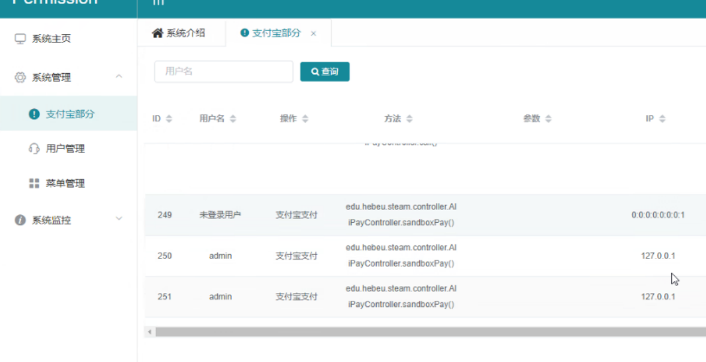
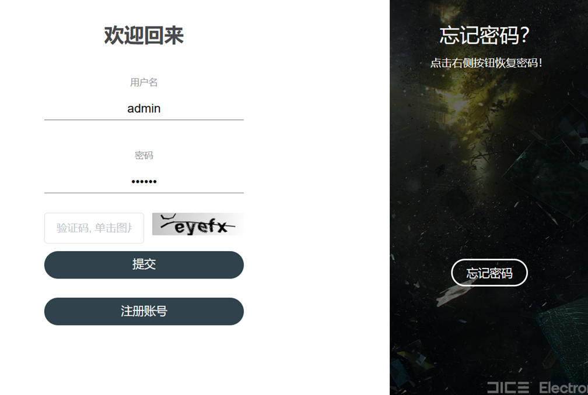
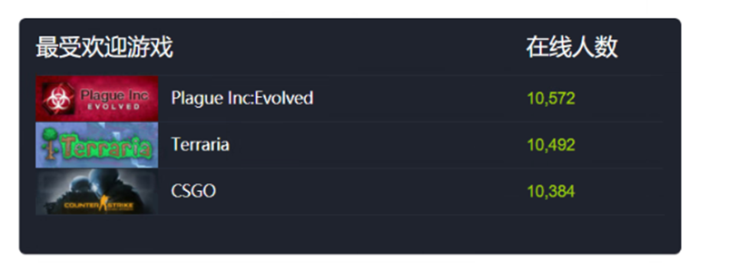
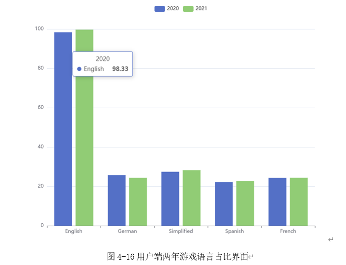
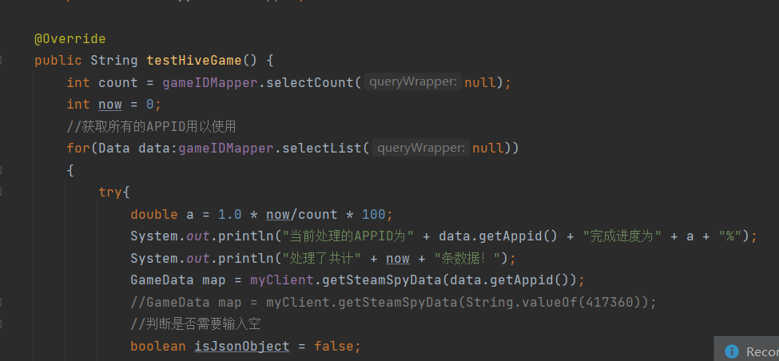
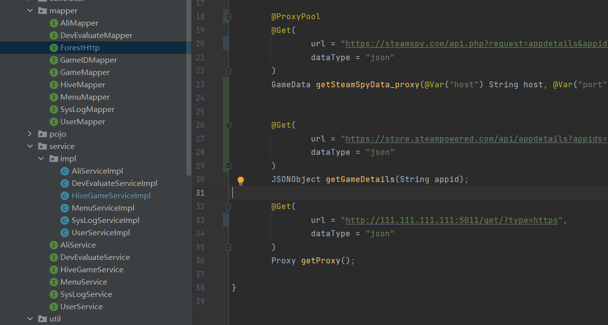
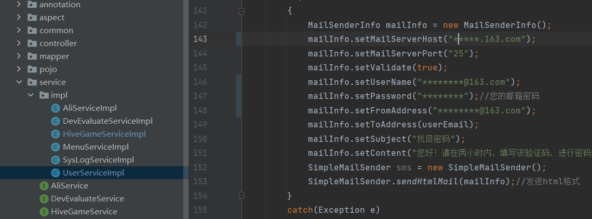

# 大数据课设-Spark(Hive Mode)游戏分析平台

帮上忙的话可以过来点个star什么的，不然这项目我都不知道多少人拿走了……

## 前言

该项目为邯郸某曾经搬了新校区的大学的大数据结课课设。有意思的是，课设对应课程教学内容为Python，Pandas和Matplotlib，而指导书是这样的：

>1、为进一步体现大数据处理过程的多元化，让同学们认识到更多的技术架构，技术选型主要包括但不局限于如下方面：
>
>（1）分布式文件系统、NoSQL数据库
>
>（2）Hadoop、spark
>
>（3）统计单词等基准测试
>
>（4）大数据可视化软件
>
>2、此次课设实践过程主要从数据来源、数据处理、数据可视化三个方面重点考核。
>
>数据来源：通过八爪鱼工具在网上爬取数据（10000条以上），不能使用虚拟数据；
>
>数据处理过程:包括数据预处理、数据分析过程（这部分在报告里要详细说明）；
>
>数据可视化: 根据题目背景，要求有空间地理维度等至少3种维度展示可视化结果，即通过Echarts等工具，利用不同形式的图示，从三个角度展示所选题目的可视化结果。
>
>3、每组每个成员要有10个数据接口的工作量（数据接口清单需要在报告里以表形式列出）；
>
>4、综上，本次课设是Web开发实践的升级版课设，需要在前后端系统搭建基础上，体现数据分析过程及可视化结果。

先不提爬虫这玩意的危险性，这个任务书要求就透露着十足的诡异，不仅和原本的课程没有任何关系，甚至变成了Java课设，而抓取的又是死数据，展示又要把数据展示活了->但是又要凑三十个接口？！

**课设总时长五周，然而第一周周末告知的我们，第二周考研，后来说又提前了一周，最终时间也就两周左右。同时还赶上我们全组考研+阳了（好悬没死在课设里，答辩都是喘着气来的），万幸的是答辩老师并没有难为我们，在此向开发时私下对各位老师的不当言论深表歉意。**

由于需要凑三十个接口，里面水了大量的前后端接口。

另：hive数据库因为在答辩完成之后就被黑了，所以元数据库丢失，只能提供SQL，也就是说部署该项目是有一定的麻烦的。

另2：本项目还有两个前端，其中一个前端来源于魔改的https://github.com/goufaning/permission-app，

而这个的来源又是https://gitee.com/liuge1988/kitty-ui,

所以各位参考时可能看到大量冗余代码；另外一个则是朋友魔改，乃是VUE3+VUE2的结合，突出一个诡异，我们组所有后端加一起都玩不明白组件传值（折腾到凌晨三点），所以有的页面干脆写死了数据，也请各位注意。

## 技术选型

虽然spark对接用python比较合适，但考虑到时间紧迫+项目无人有python 的web开发经验，不得不使用Springboot+mybatis-plus+多数据源的组合；

同时使用了sa-token进行"部分权限认证(因为大部分权限认证被去除防止演示出问题，只有很少的一部分使用了权限检查)"

## 功能

本项目对SteamSpy分析的游戏数据做二次分析（但名义上是对Steam的数据进行分析以减少工作量），统计了包括但不限于最受欢迎种类，最受欢迎游戏等数据信息，并允许用户付费（支付宝沙箱）以获取基于大数据的开发者评测。功能较少，但完美符合奇怪的指导书的要求（注：使用了redis）

这是说明书上写的功能：

- 用户登录。 

- 用户注册。

- 用户找回密码。

- 用户查看2021年词汇。

- 用户查看最受欢迎游戏列表。

- 用户查看受众最高游戏列表。

- 用户查看游戏详情。

- 用户查看游戏开发者相关游戏列表。

- 用户查看最受欢迎类别占比。

- 用户查看最不受欢迎类别游戏占比。

- 用户查看语言占比对比。

- 用户支付。

- 用户查看相关评语。

- 管理员登录。

- 管理员查看用户端统计信息。

- 管理员查询用户信息。

- 管理员修改用户信息。

- 管理员删除用户信息。

- 管理员查看支付信息。

- 管理员修改菜单信息。

- 管理员添加菜单信息。

- 管理员查看jvm信息。

- 管理员查看tomcat信息。

- 管理员查看系统信息。

- 管理员查看系统日志。

为此制作了Windows版本使用的hadoop+spark+hiveserver(基于spark)，如有需要可以来提issue，我可以择日放出配置方式及打包好的文件。

## 展示图

![CX6E~C7O[D{(A$9ZBR~]O6H](./assets/clip_image002.jpg)

（注：图里的狗是没有贴标签的游戏，处理不当变成了狗，但是我们懒得改）

（注：是的，就是抄的steamdb的界面，上面的显示是临时改的，当时功能还没做，但是报告马上交）

## 项目配置方法

由于hive部分的缺失，您只能自己重建hive数据库了。

您可以通过Dbeaver去远程hive数据库。

这个方法（我怎么不记得哪儿用了他）就是把mysql的数据去steamspy查询，并添加到hive里的方法，为此你需要根据这个实体类在hive里新建一个表。（原本命名是gamedata2）

这玩意由于有请求限制，所以请求一万条数据大概要9个小时，您需要用github上的python代理池配置一下，然后在这里改一下代理池获取地址：

您还需要改动一下这里：

保证找回密码正常工作。

本来应该把hive的数据库直接上传奈何被别人打了，索性就这样吧，这个配置难度变高了，有需要再细说吧。提供hive的SQL和MySQL的SQL，祝想用项目的各位好运。
